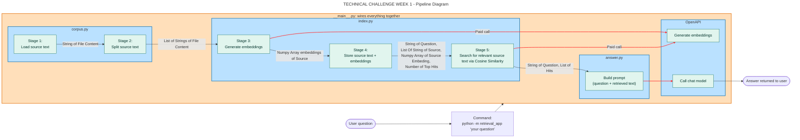

```mermaid
---
title: TECHNICAL CHALLENGE WEEK 1 - Pipeline Diagram
---

flowchart LR
    U([User question]) --> CMD["Command:<br/>python -m retrieval_app 'your question'"]
    CMD --> MAIN

    subgraph MAIN["__main__.py: wires everything together"]
        direction TB

        subgraph CORPUS["corpus.py"]
            S1["Stage 1:\nLoad source text"]
            S2["Stage 2:\nSplit source text"]
            S1 --> |String of File Content| S2
        end

        subgraph INDEX["index.py"]
            S3["Stage 3:\nGenerate embeddings"]
            S4["Stage 4:\nStore source text + embeddings"]
            S5["Stage 5:\nSearch for relevant source text via Cosine Similarity"]
            S3 --> |Numpy Array embeddings of Source| S4 --> |String of Question, \nList Of String of Source, \nNumpy Array of Source Embeding, \nNumber of Top Hits| S5
        end

        subgraph OPENAPI["OpenAPI"]
            EMBEDDINGS_LLM["Generate embeddings"]
            LLM["Call chat model"]
        end

        subgraph ANSWER["answer.py"]
            P["Build prompt<br/>(question + retrieved text)"]
            P --> LLM
        end

        S2 -->|List of Strings of File Content| S3
        S5 -->|String of Question, List of Hits| P

        S3 --> |Paid call| EMBEDDINGS_LLM
        S5 --> |Paid call| EMBEDDINGS_LLM

        linkStyle 5 stroke:#ff3333,stroke-width:2px;
        linkStyle 8 stroke:#ff3333,stroke-width:2px;
        linkStyle 9 stroke:#ff3333,stroke-width:2px;

    end

    LLM --> R([Answer returned to user])

    classDef alphaStyle fill:#ffdfba,stroke:#e67e22,stroke-width:2px;
    classDef betaStyle fill:#bae1ff,stroke:#2980b9,stroke-width:2px;

    class MAIN alphaStyle;
    class CORPUS,INDEX,ANSWER,OPENAPI betaStyle;

    classDef stage fill:#E1F5EE,stroke:#0F6E56,color:#04342C;
    class S1,S2,S3,S4,S5,P,LLM,EMBEDDINGS_LLM stage;

```
