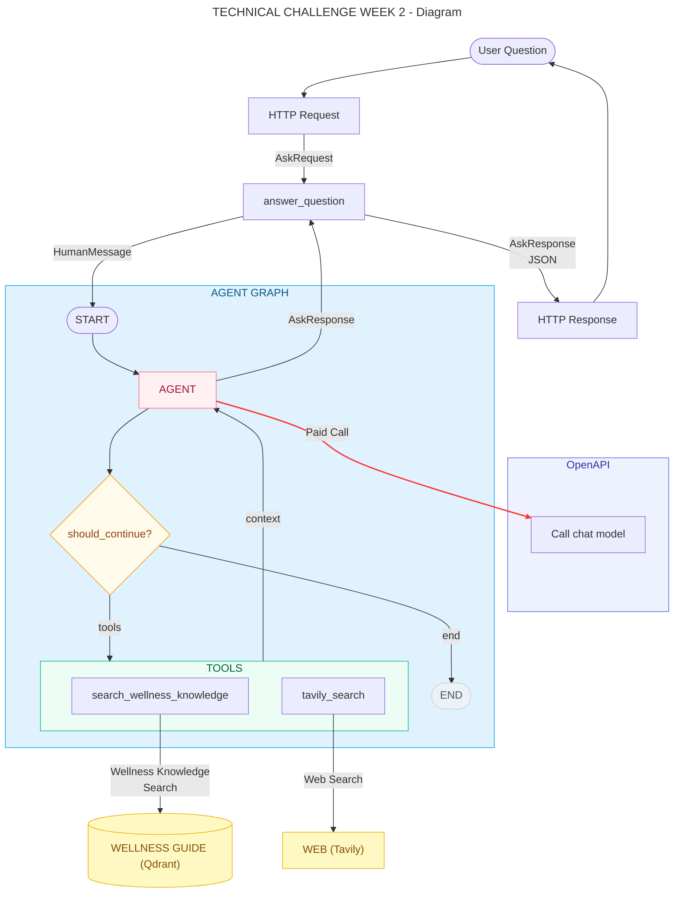

```mermaid
---
title: TECHNICAL CHALLENGE WEEK 2 - Diagram
---

flowchart TB
    user([User Question]) --> http_request["HTTP Request"]
    http_request -- "AskRequest" --> answer_question["answer_question"]
    answer_question -- "HumanMessage" --> start

    subgraph AGENT_GRAPH["AGENT GRAPH"]
        start([START]) --> agent["AGENT"]
        agent --> decision{"should_continue?"}
        decision -- "tools" --> TOOLS
        decision -- "end" --> END([END])
        TOOLS -- "context" --> agent
    end

    subgraph OPENAPI["OpenAPI"]
        LLM["Call chat model"]
    end

    subgraph TOOLS["TOOLS"]
        search_wellness_knowledge["search_wellness_knowledge"]
        tavily_search["tavily_search"]
    end

    search_wellness_knowledge -- "Wellness Knowledge <br>Search" --> guide[("WELLNESS GUIDE (Qdrant)")]
    tavily_search -- "Web Search" --> web["WEB (Tavily)"]

    agent -- "Paid Call" --> LLM

    agent -- "AskResponse" --> answer_question
    answer_question -- "AskResponse <br>JSON" --> http_response["HTTP Response"]
    http_response["HTTP Response"] --> user

    linkStyle 10 stroke:#ff3333,stroke-width:2px;
    %% linkStyle 11 stroke:#ff3333,stroke-width:2px;

    classDef terminal fill:#eef2f6,stroke:#cbd5e1,color:#475569
    classDef agentNode fill:#fff1f2,stroke:#fb7185,color:#9f1239
    classDef decisionNode fill:#fffbeb,stroke:#f59e0b,color:#92400e
    classDef toolNode fill:#ecfdf5,stroke:#10b981,color:#065f46
    classDef source fill:#fef9c3,stroke:#eab308,color:#854d0e
    classDef alphaStyle fill:#e0f2fe,stroke:#0ea5e9,color:#075985
    classDef openapi fill:#eef2ff,stroke:#6366f1,color:#3730a3

    class AGENT_GRAPH alphaStyle
    class OPENAPI openapi
    class END terminal
    class agent agentNode
    class decision decisionNode
    class tools,TOOLS toolNode
    class guide,web source
```
